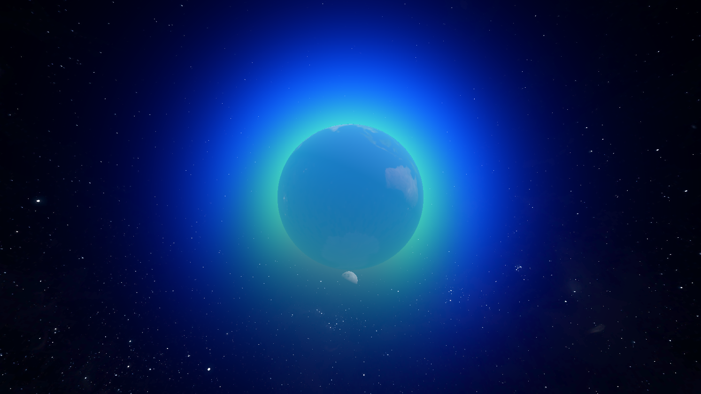
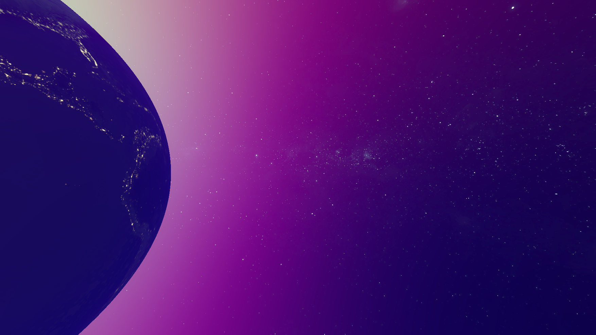
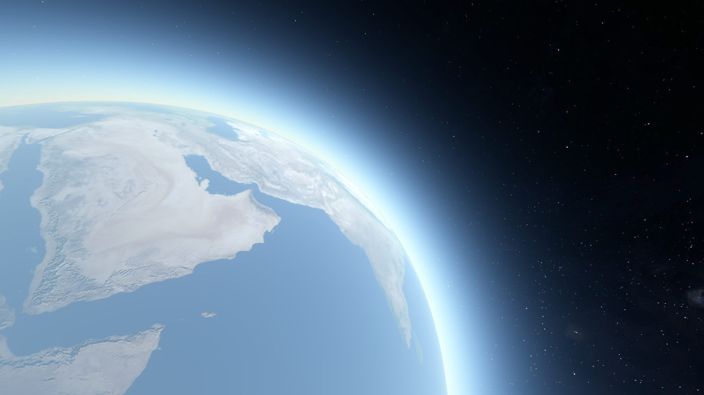

# Solar System Graphics Programming Experiments

Some fun graphics programming experiments. Written in the Godot Engine.

## Atmospheric Scattering

Mostly following https://developer.nvidia.com/gpugems/gpugems2/part-iii-high-quality-rendering/chapter-23-hair-animation-and-rendering-nalu-demo. Uses a fragment shader for rendering and a computer shader for generating the out scattering integral.

Example Outputs:

